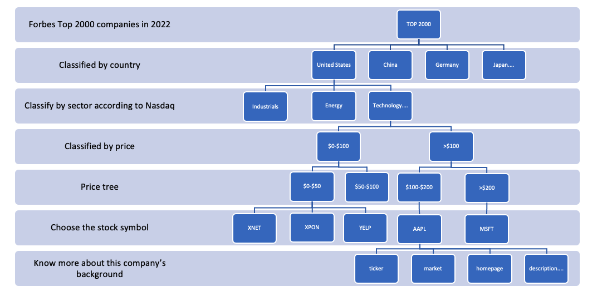

<h1>Fall 2022 SI 507 Final Project</h1>
<h2>Instruction</h2>

This project uses interactive command shell to search the background information of a stock.
The project is mainly divided into two parts:
 1) The companies in Forbes Top 2000 in 2022 are web scrapped and saved as a JSON file.
   The companies are classified into different countries, which are saved as a JSON file
 2) The user can choose the company they want to know from a certain industry.
 3) User can decide the stock symbol base on a series of price choice.
 4) Users can also choose the background information they want to know about the stock.
 5) A SMA-5 and 10 days figure will be showed to help witht the trading decision.

<h2>Data source</h2>

 
 <b>1) Web scrapping: https://www.forbes.com/lists/global2000/?sh=1d4699995ac0</b>
    Volume: 2000 companies in total
    Challenge score: 4. Scraping a new single page
    Related file: 
   scrapping_top2000.json: The full list of company from webscrapping.
   by country_list.json: Classification of companies by their country 
 <b>2) API: </b>
    Stock API : https://www.alphavantage.co/
    Financial data market API: https://polygon.io/
    Challenge score: 4. Web API you haven’t used before that requires API key or HTTP Basic authorization
    Related file: 
   detail_price_tree.json: A price tree of the chsoen dstock symbols.
 <b>3) Nasdaq CSV:Provide all the Nasdaq listed stock.</b>
    Stock Screener: https://www.nasdaq.com/market-activity/stocks/screener
    Challenge score: 2. CSV or JSON file you haven’t used before with > 1000 records:
    Volume: 8164 stocks in total
    Related file: 
   nasdaq_list.csv: The original csv downloaded from the Nasdaq.
   nasdaq_dict.json: The json version of the above csv. 
   nasdaq_byindustry.json:Classification of companies by their sector

<h2>Data structure</h2>

<h2>Demo Video</h2>
https://www.youtube.com/watch?v=q2LijsZDMys
 
 
<h2>Prerequest</h2>
Python3, Plotly, JSON, requests, Matplotlib, BeautifulSoup, CSV, pandas_datareader, datetime
 
 
<h2>Interaction and Presentation</h2>
Through the command line prompts in the VS code. 

Q1-1 Get to know with the Forbes 2000========================================================================
 We have scrapped the data from <Forbes Global 2000>, which ranks the largest companies in the world using four metrics: sales, profits, assets, and market value. Among all of these compnaies, which company you want to know? please give a number between 1-2000! 

 Expected input: Integer range from 1 to 2000

 Output: A company in that rank

 Which country you want to know more?

 Expected input: Country name from the given country list

 Output: A company list in that country

 You can check with the <scrapping_top2000> file and choose which company you want to know more?

 Expect input: Any words of the company name, does not need to be exactly the company name. For example:'apple' can be accpeted. 

 Output: The sector this company in will be returned

Q3 Choose other stock in the same sector========================================================================
 Inorder to form a better trading decision, you can also choose other stocks in the same industry to make a reference!
Here is the stock symbol in the Technology

 Output: The stock symbols in that sector will be returned

Q4 Choose benchmarking company========================================================================
 Please input in stock symbol in the above list to make further analysis. Please input at most 10 stocks! (Format: ADT, ADTH, .... )   XNET,XPON,YELP,MSFT     

 Expect input: A string of stock symbol split by ",". The input of string will be cleaned and transformed to a list.

For example:  XNET,XPON,YELP,MSFT  ---->    ['XNET', 'XPON', 'YELP', 'MSFT', 'AAPL']
  Output: The stock symbols list wil be returned

Q5 Detail of chosen stock in the input date. ==========================================================================
 Which date's price do you want to see? Please ensure it was a trading date! (For example:2022-11-29) 

 Expect input: A date like 2022-12-02

 Output: The stock price detail of the above stock list on the chose date will be returned

Q6 Choose the stock based on the price tree============================================================================
 Which stock price range you want to choose?(Please choose from: $0-$100, >$100) . 

 Expect input: A choice between $0-$100 and >$100

Do you want to know more about this company? (Yes/No) 

 Expect input: yes /no 

 Output: List of what kind of information about that company is provided.
 What kind of information you want to know? Please choose from [dict_keys(['ticker', 'name', 'market', 'locale', 'primary_exchange', 'type', 'active', 'currency_name', 'cik', 'composite_figi', 'share_class_figi', 'market_cap', 'phone_number', 'address', 'description', 'sic_code', 'sic_description', 'ticker_root', 'homepage_url', 'total_employees', 'list_date', 'branding', 'share_class_shares_outstanding', 'weighted_shares_outstanding', 'round_lot'])]

 Expect input: The key in the give list of dictionary keys 

Q7 Moving average plot for trading advice==========================================================================
 Do you want to have some technicial choice? (Yes/No) 

 Expect input: yes /no 

 Output: A figure of MA 5/10 days and relevant financial explanation will be provided. 
 When the short term moving average crosses above the long term moving average, this indicates a buy signal. Contrary, when the short term moving average crosses below the long term moving average, it may be a good moment to sell.
 Hope it helps you! See you. 

